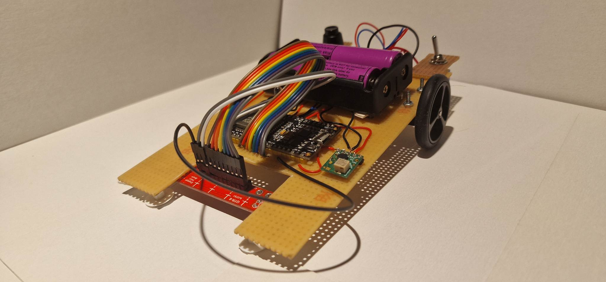

# LineFollower
 

  
## specifications
 
microcontroller: ESP32 NODEMCU Module WiFi
 
motors: pololu micrometalgear 1:50 HP
 
h-bridge: DRV8833
 
sensors: QTR8-A (alle 8 sensoren gebruikt)
 
batteries: 18650 Li-ion
 
wireless communication: ingebouwde bluetooth
 
distance sensor - motors: 105mm
 
weight: 210g
 
speed: 0,759m/s
 
